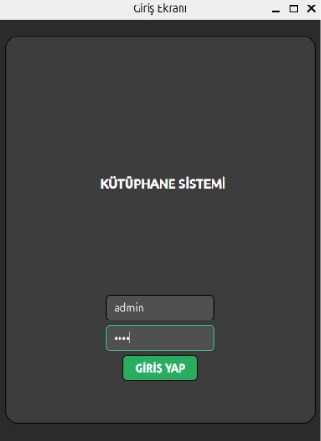
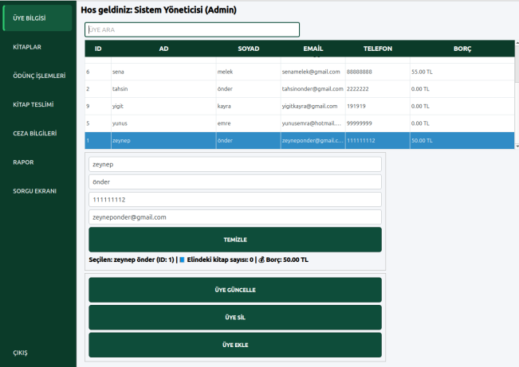
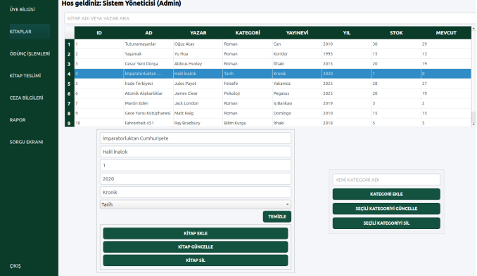
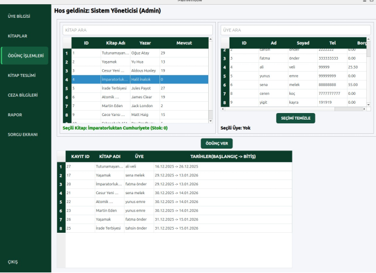
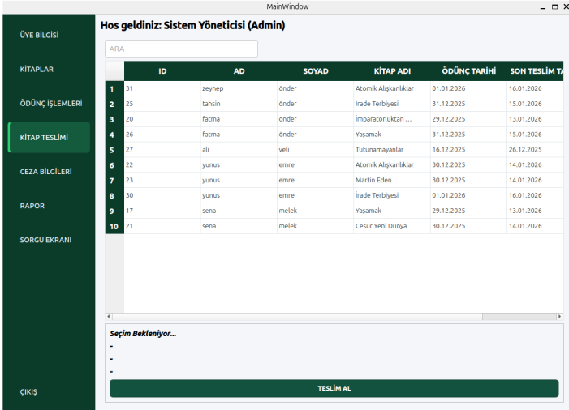
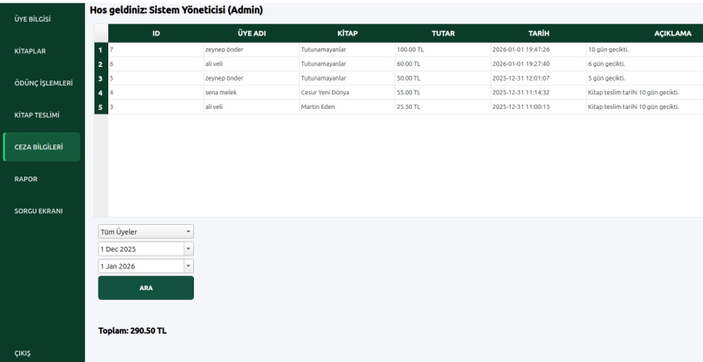
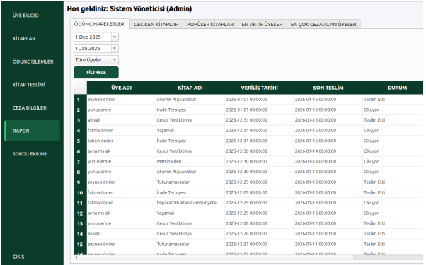
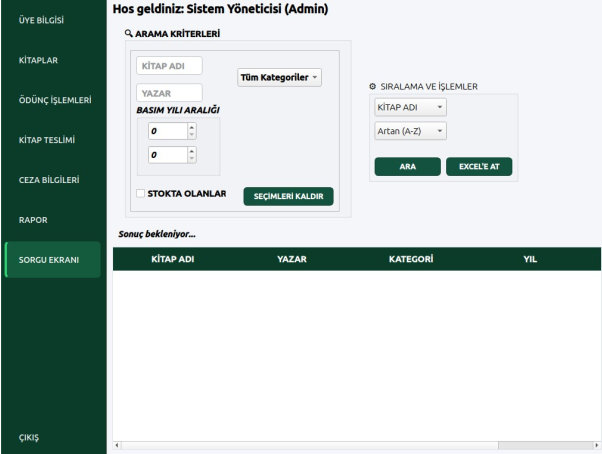
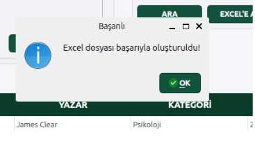
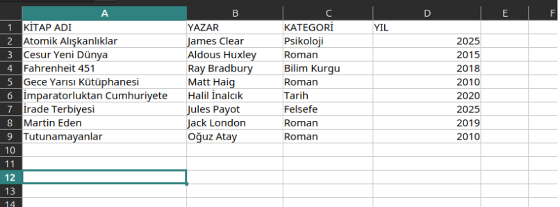

# Kütüphane Yönetim Sistemi 📚

Bu proje, Python ve MySQL kullanılarak geliştirilmiş kapsamlı bir kütüphane yönetim otomasyonudur.

## 🛠️ Proje İçeriği
* **main.py:** Uygulamanın ana giriş noktası ve arayüz mantığı.
* **veritabani.py:** Veritabanı bağlantı ve sorgu fonksiyonları.
* **kutuphaneOtomasyonu.sql:** Tablolar, Trigger'lar ve Stored Procedure'leri içeren veritabanı kurulum dosyası.
* **.ui Dosyaları:** Qt Designer ile tasarlanmış kullanıcı arayüzü dosyaları.

* Kullanıcı deneyimini iyileştirmek ve işlem hızını artırmak amacıyla arayüz genelinde yön tuşları ile
navigasyon ve Enter tuşu ile hızlı seçim yapma özellikleri sisteme entegre edilmiştir.

### Detaylar ve İlgili Görseller

**Giriş Ekranı:**

* Solda sabit bir şekilde duran butonlar ile ekranlar arası geçiş yapılır.

**Üye Bilgisi Ekranı:**

* Arama motoru ile ad, soyad veya emaile göre üye seçilebilir. Üye üzerine borç veya kitap varsa üye silinemez

**Kitap Yönetim Ekranı**

* Kütüphane envanterinin yönetildiği, yeni kitap girişlerinin yapıldığı ve stok durumlarının kontrol edildiği modüldür.
* Arama motoru: Kitap adı veya Yazar bilgisiyle filtrelenir.
* Yeni kategori eklenebilir. Seçilen kategori silinebilir, güncellenebilir.
* Kitap aktif olarak ödünçteyse silinmez.
* Kitap ekle ile seçilen kitabın üzerine ekleme yapılabilir veya kütüphanede olmayan bir kitap eklenebilir.
* Kitap Güncelle ile seçilen kitap bilgileri güncellenebilir.

**Ödünç İşlemleri:**

* Ödünç verilecek kitap, arama butonuyla ya da liste üzerinden seçilir. Aynı işlem ödünç alacak üye için de yapılır.
*  Kitap mevcut stokta varsa üyeye verilir. Yoksa hata oluşur.
*  Kitap ödünç verildikten sonra mevcut stok azalır.
*  Alttaki tabloda ise bir üye seçildiğinde sadece o kişiye ait kitaplar listelenirken, seçim yapılmadığında kütüphanedeki tüm aktif ödünç kayıtları görüntülenir.
*  Üye üzerinde 3 adet kitap varsa daha fazla kitap almaya çalıştığında uyarı alır.
*  Üye aynı kitabı almak istediğinde uyarı alır.

**Kitap Teslim Ekranı:**

* Teslim edilmemiş ödünç kayıtları listelenir.
* Üye adına, kitap adına veya tarihlere göre arama yapılabilir.
* Kayıt seçildiğinde üye adı, kitap adı, ödünc tarihi ve son teslim tarihi gösterilir.
* Teslim alındıktan sonra kitabın mevcut adet değeri artar.
* Son teslim tarihi geçtiyse ceza kaydı oluşturur.
* Ceza kayıt tablosuna kaydedilir.

**Ceza İşlemleri:**

**Statik Sorgu Ekranı:**

* Kütüphane yönetim sistemindeki verilerin analizi ve takibi için geliştirilen raporlama mekanizmasıdır.
* Ödünç Hareketleri sayfasında butonlar yardımıyla üyelere göre veya tarih aralığına göre filtrelenebilir.
* Geciken kitaplar sayfası, Popüler kitaplar sayfası ,Aktif üyeler sayfası, En çok ceza alanlar sayfası bulunur.

**Dinamik Sorgu ve Excel Çıktısı:**

* Kullanıcı oluşturduğu kombinasyonlara göre excel çıktısı oluşturabilir.

